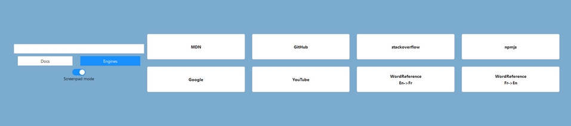

# Searcher

SPA made in order to browse the net faster.  
Try it on [GitHub Pages](https://totone.github.io/searcher).  

## Stack

Small Application made to handle [Ant Design](https://ant.design/).

- ReactTS
- Ant Design

## Howto

Enter what you are looking for in the Input field & then click on a button to search with the corresponding search engine.  
You also can sort your links according to their purpose & then switch between buttons types thank to Switch buttons types under the Input field.  
Once you clicked a button, request is sent to targeted engine in a new browser tab.

## Responsive

Made to match 2 types of screen:

- Desktop screens
- Asus ScreenPad (32/9 Touchscreen)

Switch can be done with the Switcher under Switch buttons.  
Screenpad view is convenient when you are on an Asus (Pro) Duo laptop: you can fill the input & browse with keyboard shortcuts.  
Icing on the cake: Input automatically gets the focus back.

### And for smartphones ?

I didn't develop a full layout for small screens like smarphones: I simply don't need it.  
Feel free to add this.

## Summary

Searcher is a convenient lttle tool to search things across the web.  
`src/_config/` folder contains configuration files (format JSON):

- `INPUT_FLAG`: Flag to be replaced by the input - related to the `browser` service
- `buttons_list/`: Lists of buttons - related to `getButtonssList` service
- `SWITCHERS`: List of switchers

Feel free to fork, edit, upgrade, or do whatever you want with this project. It is [WTFPL License](https://en.wikipedia.org/wiki/WTFPL).